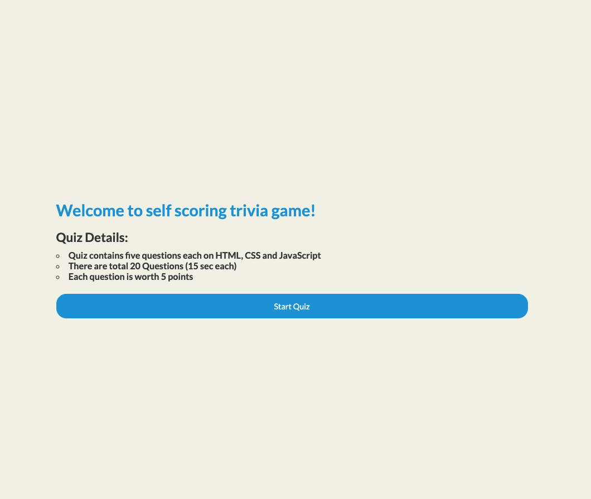

# Trivia Game

Check your HTML, CSS and JavaScript knowledge.

Used with permission for Craft vs Cruft refactoring challenge. Original author anonymous.

https://www.youtube.com/channel/UC4nEbAo5xFsOZDk2v0RIGHA

See branch `01-trivia-game-html-js` for result or make your own.

**Description**

This project is designed to test user's programming Knowledge. This app contains five questions on each HTML, CSS and JavaScript. Each question is worth five points.

**Example**

This is what app looks like

**User Stories**

•When user enters a website, it should contain information about quiz and start button to navigate to quiz.

•When user start a quiz, there should be selection option for each quiz choice.

• User should be prompted only one question at a time and there should be next button to move to next question.

• Users should not be able to go to next question without selecting any option.

• Users should also be able to see if selected answer is correct or wrong.

• Upon end of the quiz:

• User should be able to see their overall score

• User should be able to restart the quiz.

List of Technologies Used

• For this project I have used HTML, CSS and JavaScript.

• VSCode editor is used to build this app.

**Installation Instructions**

To set up app locally on your system

1. fork and clone this repository
2. Install VsCode locally and ensure it is running.
3. Lastly, startup your server using live server option in VSCode.
